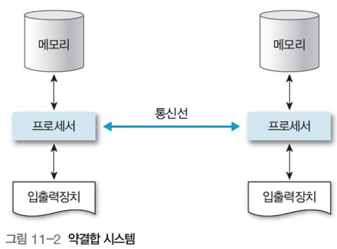
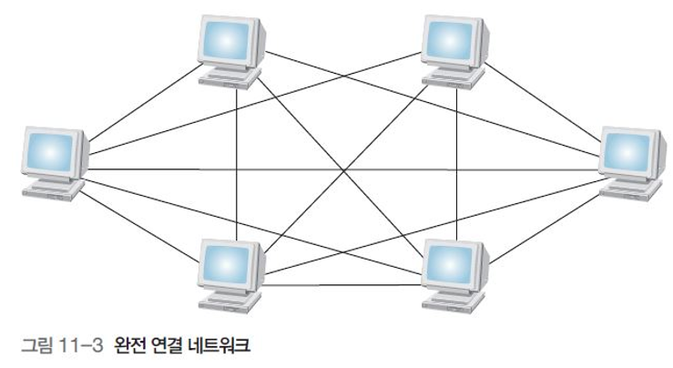
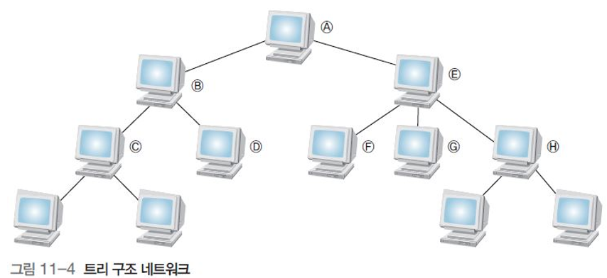
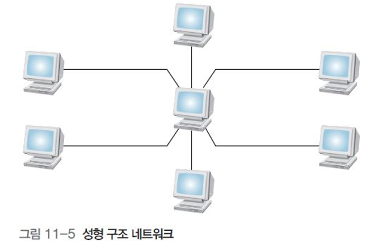
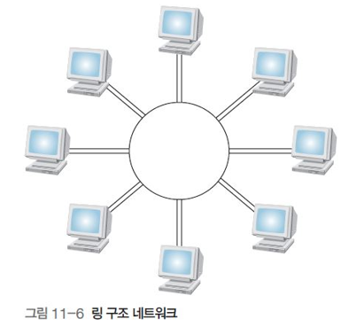
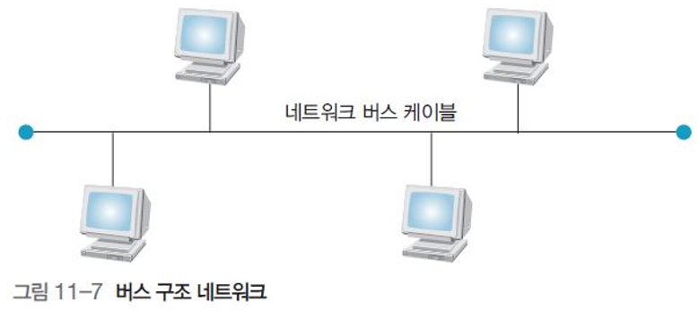
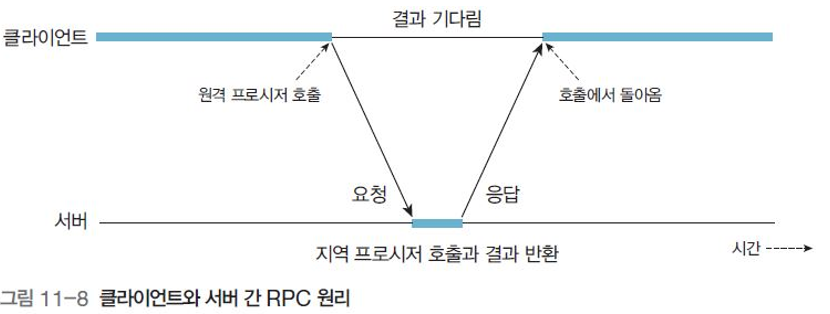
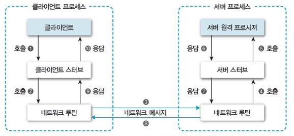
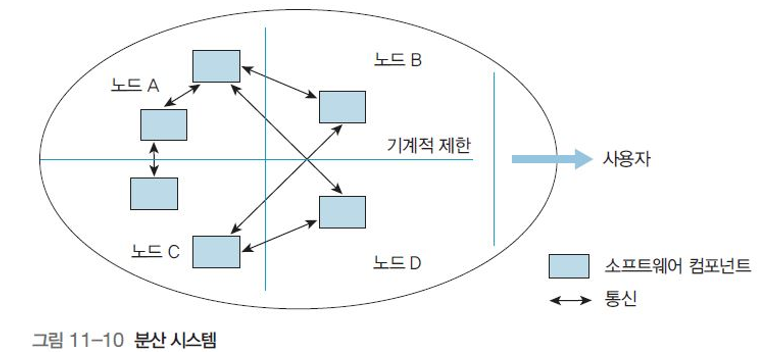

# 분산 및 다중 처리 시스템

## 분산시스템

________

### 네트워크와 분산 시스템의 개념

- 컴퓨터 사용자 간 데이터 교환을 위해 네트워크로 상호 연결

- 분산 시스템과 다중 처리 시스템으로 구분
  - 분산 시스템
    - 메모리와 클록을 공유X
    - 지역 메모리를 유지하는 프로세서로 구성
    - 서로 독자적으로 동작
  - 다중처리 시스템
    - 하나 이상의 프로세스로 구성
    - 프로세스들이 메모리와 출력을 공유

### 네트워크의 개념

​	서로 독립된 시스템 몇 개가 적절한 영역 안에서 속도가 빠른 통신 채널을 이용하여 상호 통신할 수 있도록 지원하는 데이터 통신 시스템

- 강결합 시스템

  프로세서들이 메모리 공유

  공유 메모리를 점유하려는 프로세서간의 경쟁을 최소화해야 함

   => 경쟁은 결합교환방법으로 해결

  - 결합 교환(Combining Switch)

    오직 하나의 프로세서만 공유 메모리 액세스 허용

  

- 약결합 시스템

  둘 이상의 독립된 시스템을 **통신선**으로 연결

  필요할 때만 통신선을 이용하여 메시지 전달이나 원격 프로시저 호출로 통신

  하나의 시스템에서 장애가 발생해도 다른 시스템의 프로세서에 영향X

  

### 네트워크의 구조

- 망(mesh) 구조

  완결 연결(fully connected) 방법

  초기 설치비 많음

  매우 빠름

  신뢰성 높음

  

- 트리(tree) 구조(계층(hierarchy) 구조)

  각 노트가 트리로 구성

  인트라넷에서 활용

  루트를 제외하고 단일 부모와 자식 몇 개를 가짐

  망구조보다 기본비용이 저렴

  부모가 고장나면 자식은 서로 통신 불가, 다른 프로세스와도 통신 불가

  

- 성형(star) 구조

  중앙 노드와만 직접연결

  중앙 노드가 메시지 교환 담당

  병목현상 발생 가능

  중앙 노드 장애는 전체 시스템 마비

  기본비용은 노드수에 비례, 통신비용 저렴, 집중 제어로 유지보수 용이

  

- 링(ring) 구조

  각 노드를 정확히 다른 노드 2개와 연결

  메시지 전달방향은 단방향/양방향 존재

  단방향구조에서는 하나의 노드나 링크가 불능이되면 네트워크 분할

  양방향은 2개 고장나면 분할

  메시지가 링을 순환하면 통신비용 증가

  

- 버스(bus) 구조

  연결 버스 하나에 모든 노드 연결 방법

  버스를 공유하여 경제적

  각 노드의 고장은 나머지 노드 간 통신에는 영향X

  노드의 추가, 변경, 제거 등이 용이

  but, 버스가 고장나면 모든 노드 간 통신 불가능

  

### 원격 프로시저 호출(RPC, Remot Procedure Call)

​	분산 시스템과 단일 시스템의 가장 큰 차이는 프로세스 간 통신.

​	분산 시스템은 공유 메모리 X

​	하나의 컴퓨터에서 실행하는 프로세스를 다른 컴퓨터에서 실행하는 프로세스의 프로시저가 호출 가능. 클라이언트/서버 모델.

​	클라이언트 프로세스가 서버 프로시저를 호출하면 클라이언트 프로세스는 중단되고 서버 프로시저가 실행됨 -> 반환값은 네트워크를 이용해 클라이언트로 전송

- 일반적인 RPC 단계(요청과 응답관계, 1:1)

  

  

  ##### 스터브(stub)

  ​	전송 데이터를 준비하고 수신 데이터를 변환해서 올바르게 해석할 수 있도록 지원하여 처리 결과를 교환하는 모듈

  ​	클라이언트 스터브와 서버 스터브로 분류

- RPC 동작 과정

  

### 분산 시스템의 구조와 구축 목적

- 분산 시스템의 구조

  

  저렴한 노드 여러개를 운영체제 하나가 제어하여 하나의 프로그램처럼 동작

- 구축 목적

  자원 공유 용이

  연산속도 향상

  신뢰성 향상

  통신 기능

- 기본 목표

  각종 자원의 투명성 보장

  => 상호연결된 컴퓨터를 사용자가 하나의 컴퓨터 시스템으로 인식할 수 있도록 함

## 